# FARAD — Autonomous Underwater Vehicle (AUV)

**TEKNOFEST 2025 · Unmanned Underwater Systems Competition · Advanced Category**
Team FARAD (Azerbaijan) · Application ID `3478075`

A fully autonomous underwater vehicle built almost entirely in-house: custom hydrodynamic hull, self-designed thrusters, two custom PCBs (flight control + power distribution), a custom waterproof servo, and a vision stack running on an NVIDIA Jetson Orin NX that trains itself while it runs.

<p align="center">
  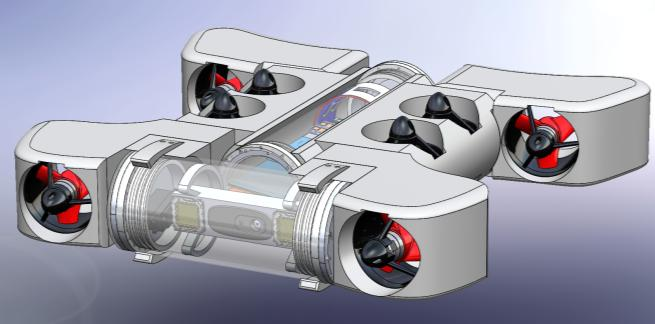
  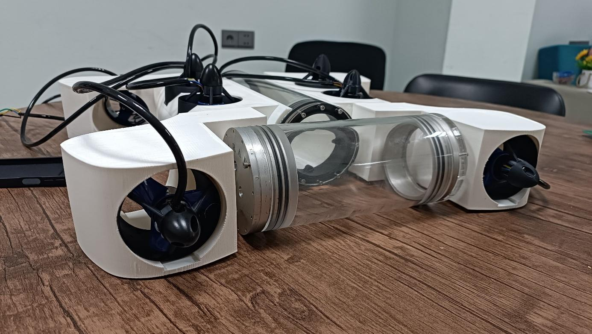
</p>

---

## Table of contents

- [Overview](#overview)
- [Specifications](#specifications)
- [Mechanical design](#mechanical-design)
  - [Design evolution](#design-evolution)
  - [Final hull](#final-hull)
  - [Pressure hulls](#pressure-hulls)
  - [Custom thrusters](#custom-thrusters)
  - [Internal electronics trays](#internal-electronics-trays)
  - [Flow simulation](#flow-simulation)
  - [Materials](#materials)
  - [Manufacturing](#manufacturing)
- [Electronics](#electronics)
  - [System architecture](#system-architecture)
  - [pSub v1 — power distribution board](#psub-v1--power-distribution-board)
  - [uSub v1 — flight control board](#usub-v1--flight-control-board)
  - [Jetson Orin NX — main computer](#jetson-orin-nx--main-computer)
  - [Custom underwater servo](#custom-underwater-servo)
  - [In-house PCB manufacturing](#in-house-pcb-manufacturing)
- [Software & algorithms](#software--algorithms)
  - [Software architecture](#software-architecture)
  - [Object detection (YOLOv8l)](#object-detection-yolov8l)
  - [Self-training pipeline](#self-training-pipeline)
  - [Image enhancement](#image-enhancement)
  - [Line following](#line-following)
  - [Navigation](#navigation)
  - [Attitude stabilisation](#attitude-stabilisation)
  - [Monocular distance estimation](#monocular-distance-estimation)
  - [Mission algorithms](#mission-algorithms)
- [Ground interfaces](#ground-interfaces)
- [Safety](#safety)
- [Testing](#testing)
- [Lessons learned](#lessons-learned)
- [Project management](#project-management)
- [What is original here](#what-is-original-here)
- [Team](#team)
- [Documentation](#documentation)
- [References](#references)

---

## Overview

Team FARAD was founded in Azerbaijan in 2020 and has been building unmanned underwater systems since 2023, competing in the AUV/ROV categories of SAF 2023 and TEKNOFEST 2024. This repository documents the vehicle developed for the **TEKNOFEST 2025 Unmanned Underwater Systems Competition (Advanced category)**.

The vehicle moves and rotates on all axes and executes the full mission set autonomously — there is no tether, so every watt on board comes from the battery. That single constraint drove most of the design: a hydrodynamic hull instead of last year's cube, ducted thrusters that direct thrust properly, and a compute split that keeps the Jetson free for vision while an ESP32 handles the real-time control loop.

A second goal was **localisation of the supply chain** — the hulls, thrusters, flight controller, power board, servo and the training dataset are all designed and produced by the team rather than bought off the shelf.

---

## Specifications

| | |
|---|---|
| **Max length** | 520 mm |
| **Max width** | 533 mm |
| **Max height** | 116 mm |
| **Volume** | 9 121 cm³ |
| **Mass** | 11.3 kg |
| **Buoyancy (mean density incl. floats)** | 0.9 kg/m³ — slightly positive |
| **Thrusters** | 8 × custom ducted thrusters (M1 underwater motors), 8 × 30 A ESC |
| **Battery** | 3S 12 V 10 000 mAh 40C Li-Po |
| **Main computer** | NVIDIA Jetson Orin NX (up to 100 TOPS overclocked) |
| **Flight controller** | uSub v1 (ESP32) — in-house |
| **Power board** | pSub v1 — in-house |
| **Sensors** | BNO055 / BNO086 IMU, BME280, BMP180, D300 depth, NEO-6MV2 GPS, Ping sonar on a 360° servo |
| **Camera** | Logitech C310 (720p) + 2 × 60 W COB LED with LDR auto-control |
| **Rated depth (simulated)** | 50 m — FOS 5.8 |

---

## Mechanical design

All CAD, flow and structural simulation was done in **SOLIDWORKS**.

### Design evolution

The TEKNOFEST 2024 vehicle was a cube. It worked, but the frontal area meant high drag, which cost speed and drained the battery fast — a serious problem for an untethered vehicle.

<p align="center">
  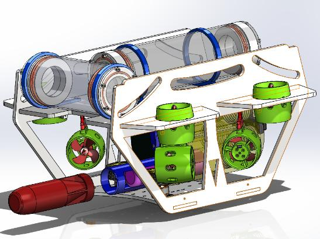
</p>

The 2025 vehicle started as a cylinder with an open frame — carrying structure only where structure was needed, to keep the vehicle light and the battery lasting longer.

<p align="center">
  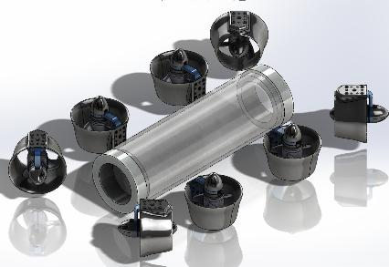
  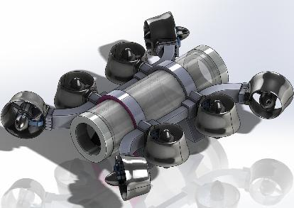
  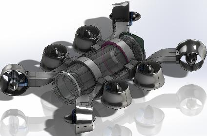
</p>

The 3D-printed prototype exposed two problems: the thin motor arms flexed badly on impact, and with a single hull the camera's field of view was too narrow to see anything below the vehicle — with no room left inside for a moving camera mount.

<p align="center">
  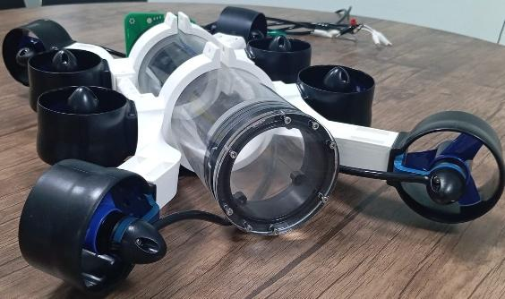
</p>

Before committing to a redesign, a second hull was bolted onto the existing frame to see whether the problems could be patched. They could not — so the frame was redesigned from scratch.

<p align="center">
  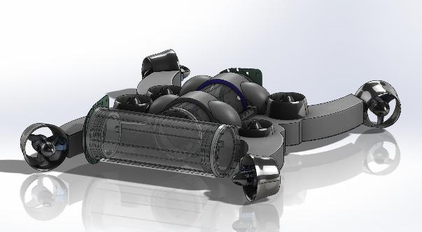
</p>

### Final hull

The final design is a **single continuous body carrying two pressure hulls** — a camera hull at the front and the main electronics hull behind it — with all eight thrusters enclosed inside the body so they survive collisions.

<p align="center">
  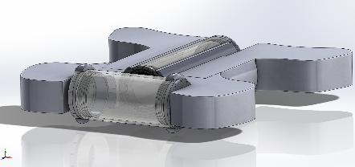
  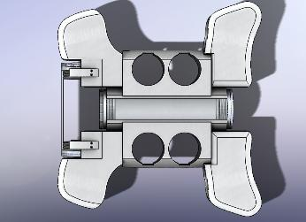
  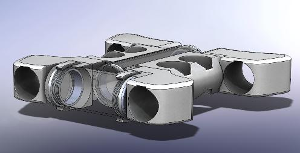
</p>

Key decisions:

- **Ducted thrusters.** The channels cut into the body straighten and direct the thrust instead of letting it wash over the frame, improving efficiency.
- **Motor angles reduced from 45° to 10°.** The control software drives the vehicle along curved trajectories like a boat or a car rather than translating along orthogonal axes; the remaining 10° only exists so single-axis motion is still possible in extreme cases.
- **Flexible clips** hold the front camera hull so it can be removed and refitted without tools.
- **Rounded corners** throughout — nothing sharp that can catch or injure.

<p align="center">
  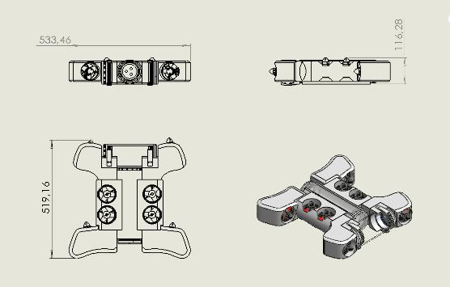
</p>

### Pressure hulls

Both hulls use **acrylic tube with machined aluminium flanges**; they differ only in length. O-ring grooves are cut into the section of the flange that enters the tube.

<p align="center">
  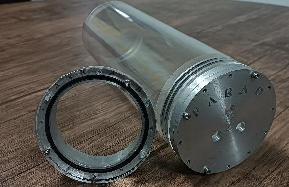
  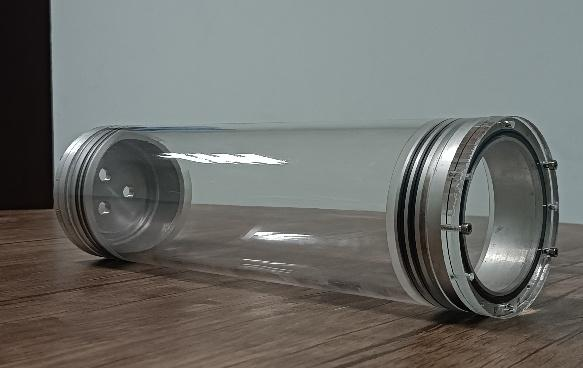
</p>

The hull was simulated at **72 psi — equivalent to 50 m of salt water** — and returned a **factor of safety of 5.8** (FOS ≥ 1 is considered safe).

<p align="center">
  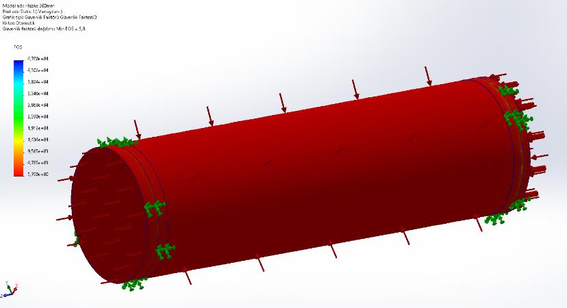
</p>

Acrylic was chosen partly because it is transparent: condensation, a leak or smoke inside the hull is visible immediately, and an **OLED screen inside the hull** showing battery level, internal temperature and humidity can be read from outside without opening anything.

### Custom thrusters

The original plan was to buy Mitras thrusters. Instead the team designed its own around the **M1 underwater motor**, 3D-printing the duct and housing.

<p align="center">
  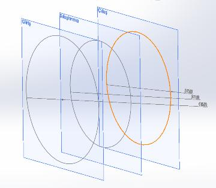
  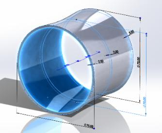
  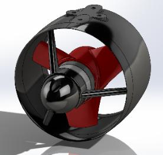
</p>

One honest limitation: 3D-printed propellers lose efficiency because of the layer transitions inherent to FDM printing, so **mould-made Degz propellers** are used instead of printed ones.

### Internal electronics trays

Every electronic component mounts to a tray that is attached to **one single flange**. Pull that flange and the entire electronics stack slides out — which matters a great deal when a board fails or a battery has to be swapped quickly between runs.

<p align="center">
  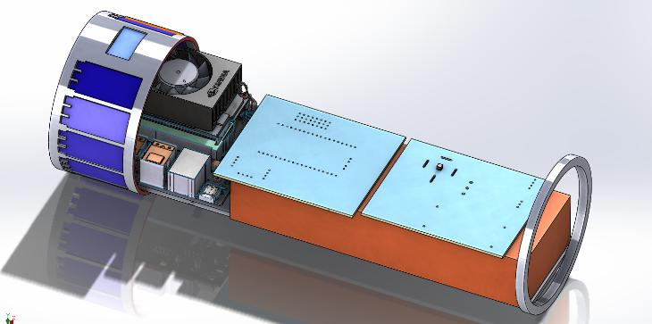
  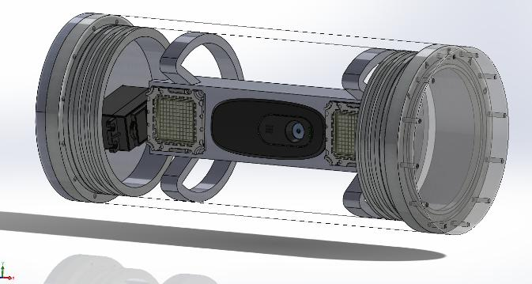
</p>

The camera-hull tray lets the camera rotate freely inside the hull, and carries the underwater lighting and the servo that turns the camera.

### Flow simulation

SOLIDWORKS Flow Simulation is used to find the high-drag regions of the vehicle. Warm colours mark fast-moving water; cool colours mark regions slowed by the vehicle's resistance.

<p align="center">
  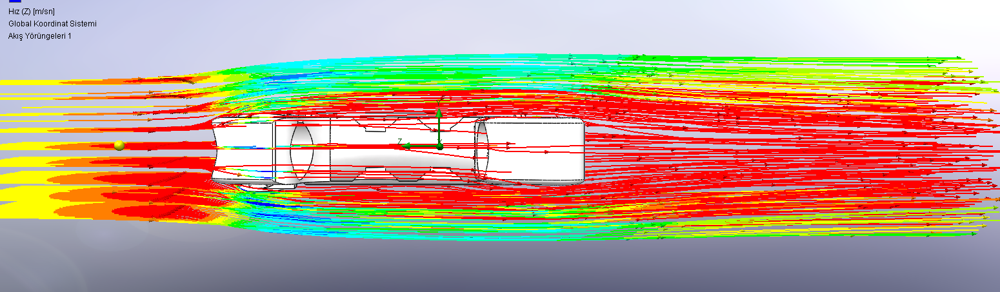
</p>

### Materials

| Material | Properties | Density | Used for |
|---|---|---|---|
| **PMMA (acrylic)** | Transparent, high hardness | 1.18 g/cm³ | Pressure hulls, front window |
| **ABS** | High stiffness and toughness, chemically resistant | 1.04 g/cm³ | Outer body, thruster housings, propellers |
| **PLA** | High dimensional accuracy, easy to print | 1.25 g/cm³ | Internal electronics trays |
| **Polyurethane foam** | Very low density, pourable into printed cavities | 0.08 g/cm³ | Buoyancy |

ABS is close to the density of water, so the body itself costs almost nothing in energy terms to move up or down. Passive trim is set by **pouring PU foam into buoyancy pockets designed into the body** — the trim can be adjusted with the vehicle already in the water, which is far more precise than bolting on external floats.

### Manufacturing

| Process | Used for |
|---|---|
| **Turning** | Aluminium flanges (modelled in SOLIDWORKS, exported to STEP, machined at a local factory), O-ring grooves, cutting acrylic to length |
| **CNC milling** | O-ring seats on the front faces of the flanges, unthreaded bolt holes in the rear cap |
| **3D printing** | Prototypes of nearly every part, plus the entire final body — printed at **100 % infill** |

<p align="center">
  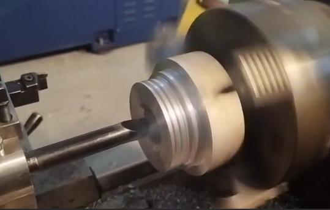
  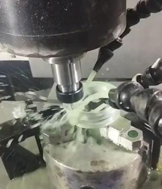
  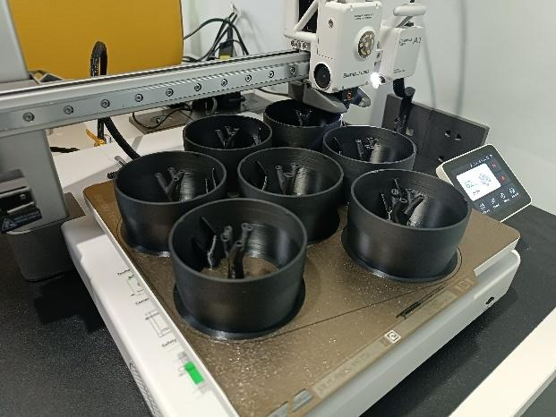
</p>

---

## Electronics

The electronics split into three subsystems:

1. **Power supply and distribution** — pSub v1
2. **Motor control and flight electronics** — uSub v1
3. **Vision and decision making** — Jetson Orin NX + camera

### System architecture

<p align="center">
  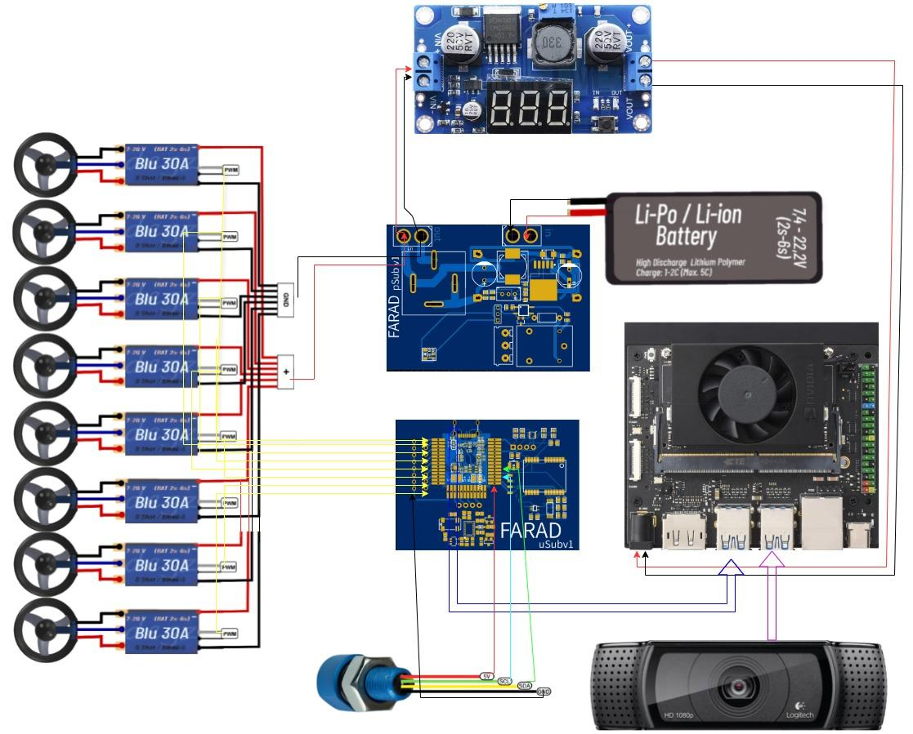
</p>

### pSub v1 — power distribution board

<p align="center">
  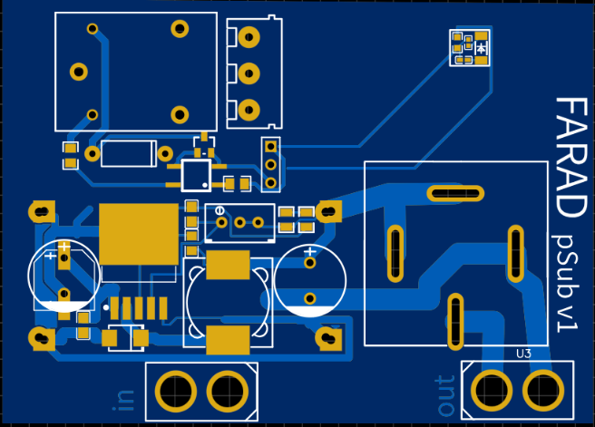
</p>

The whole vehicle runs from a **3S (12 V) 10 000 mAh 40C Li-Po**. Li-Po was chosen over Li-ion for its lower internal resistance, which gives a much more stable response to the sudden current demands of eight ESCs.

The board carries:

- **10 A and 80 A relays** — short-circuit and overcurrent protection
- **LM2596 regulator** — stable 12 V rail for the low-voltage control circuitry, fed separately from the motor rail
- **OH137 Hall-effect sensor** — magnetic power switch (see [Safety](#safety))
- Separate distribution paths for the ESC bank, the ESP32 control system and the Jetson Orin, with the high-current ESC traces reinforced to carry the load

<p align="center">
  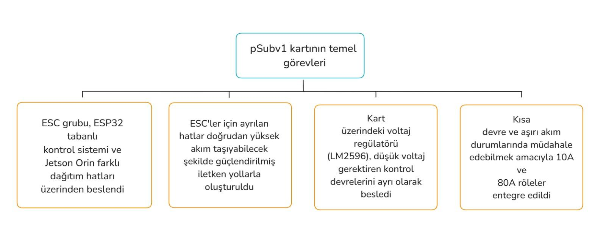
</p>

### uSub v1 — flight control board

<p align="center">
  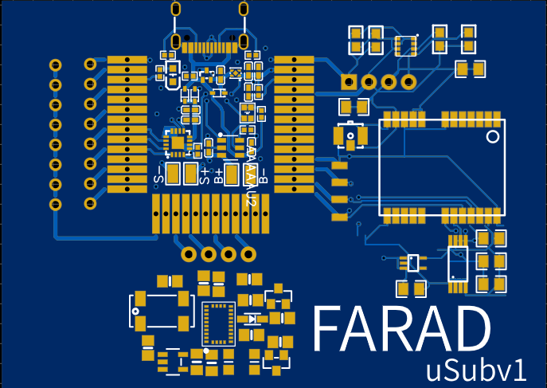
  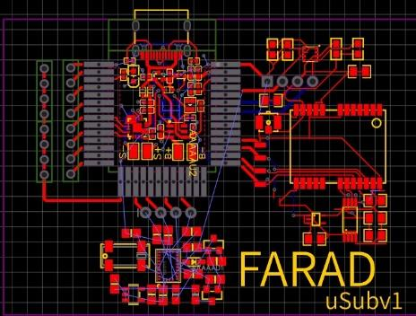
</p>

A fully in-house flight controller built around an **ESP32**. It handles all low-level electronics: reading sensors, running stabilisation, and driving the ESCs.

| Component | Role |
|---|---|
| ESP32 | Control core, motor commands, communication |
| BNO055 / BNO086 IMU | 9-axis orientation and balance; on-chip sensor fusion |
| BME280 / BMP180 | Pressure, temperature, humidity |
| NEO-6MV2 GPS | Coordinate-based tasks |
| D300 | Depth |

Interfaces: **8 PWM outputs**, multiple UART, I²C, plus digital and analog pins. IMU and depth sensor talk over I²C; everything else over UART. **PWM to each ESC is generated directly by the ESP32.**

The board speaks **MAVLink (pymavlink)** to the Jetson Orin, which relays sensor and motor telemetry to the ground station and passes commands back down.

### Jetson Orin NX — main computer

<p align="center">
  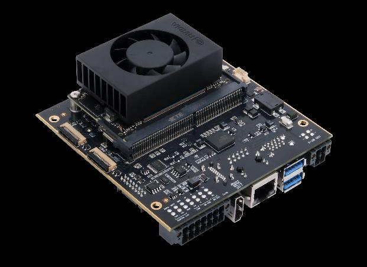
</p>

Chosen for price/performance — up to **100 TOPS overclocked**, which is what makes real-time underwater object detection possible on board.

### Custom underwater servo

The Ping sonar only measures within a **25° cone**. Rather than buying several sonars, the team built a **waterproof servo with an AS5600 magnetic position sensor** giving precise 360° rotation, and mounted the sonar on it — so one sonar sweeps the full circle and returns complete range data around the vehicle. It is both cheaper and more capable than the off-the-shelf alternatives.

### In-house PCB manufacturing

Rather than sending boards out to a fab, prototypes are made with the classic **toner-transfer (ironing) method**:

1. The Eagle board layout is laser-printed onto glossy paper.
2. The print is ironed onto a prepared copper clad board to transfer the toner.
3. Broken or thin traces are repaired under a microscope with an etch-resist pen.
4. The board is etched in a hydrogen peroxide + hydrochloric acid bath — only the toner-covered traces survive as copper.
5. Mounting holes are drilled with a Dremel.
6. Components are soldered; I/O pins get DIP sockets.

<p align="center">
  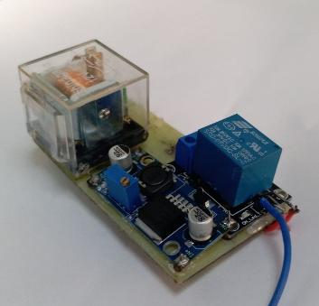
</p>

---

## Software & algorithms

### Software architecture

Two platforms, split so that high-level AI and low-level real-time control never compete for the same CPU:

<p align="center">
  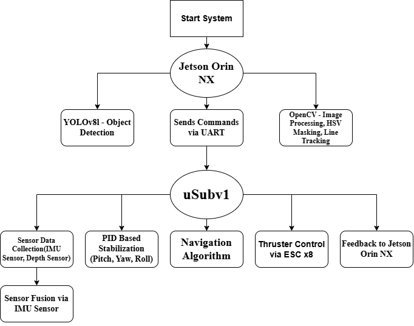
</p>

| | **Jetson Orin NX** | **uSub v1** |
|---|---|---|
| Language | Python | C++ |
| Responsibilities | YOLOv8l object detection, OpenCV processing (colour masking, line tracking), mission decisions | Sensor acquisition, sensor fusion, calibration, PID stabilisation, navigation, 8 × ESC control |
| Link | UART / MAVLink ↔ | ↔ UART / MAVLink |

Keeping fusion and balance on the ESP32 guarantees real-time control and takes load off the Jetson.

### Object detection (YOLOv8l)

**YOLOv8l** was selected after benchmarking YOLOv5s, YOLOv8x, YOLO11n and YOLO11l on FPS *and* mAP. It held detection accuracy on fixed reference objects and anomalies even when underwater image quality dropped, and ran at **20–30 FPS** — enough for real-time response.

**Jetson Orin NX — FPS comparison**

| Model | FPS (CPU) | FPS (GPU) |
|---|---|---|
| **YOLOv8l** | 2.7 | 21.6 |
| YOLO11x | 1.2 | 16.5 |
| YOLOv5s | 7.4 | 32.4 |

Pipeline: camera frame → OpenCV resize and format → YOLOv8l inference → **Non-Maximum Suppression** to drop duplicate boxes → visualised with class labels and confidence.

<p align="center">
  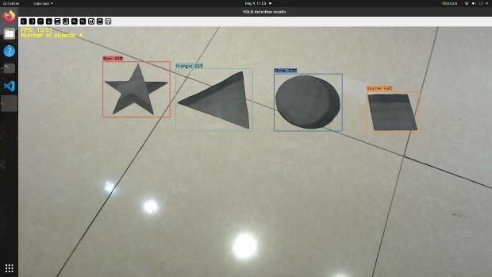
</p>

The dataset is entirely the team's own — every image shot in the field with the team's cameras and hand-labelled in **Label Studio**. The model is optimised for the Jetson (FP16, CUDA cores enabled).

### Self-training pipeline

`Auto_Training` closes the loop on data collection. Detections from the live camera feed with **confidence above 80 %** are automatically added to the training set and the model retrains on them, so the vehicle keeps improving without anyone labelling another image by hand.

### Image enhancement

Underwater footage is blurred and colour-shifted. The deblurring chain:

1. **Wiener filter** to remove blur
2. **White balance correction** to fix colour distortion
3. **CLAHE** (contrast-limited adaptive histogram equalisation) to raise contrast
4. **Gamma correction** to optimise tone distribution
5. A blue tone layer added back so the image still reads as underwater

<p align="center">
  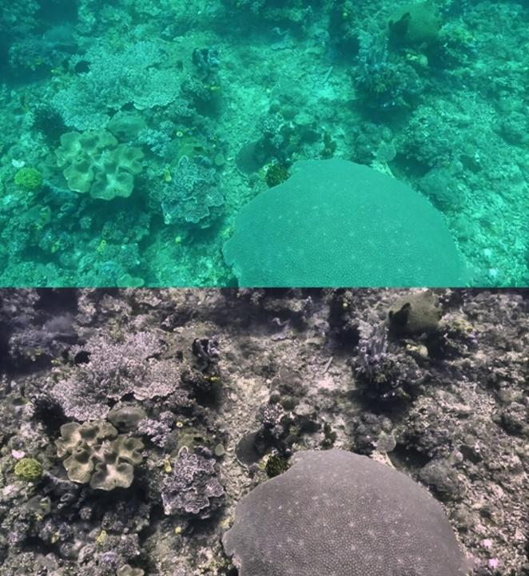
</p>

### Line following

The frame is converted to **HSV**, thresholded on the pixel range corresponding to black to produce a mask, and the vehicle turns by **differential thrust** — varying the speeds of the left and right thrusters.

<p align="center">
  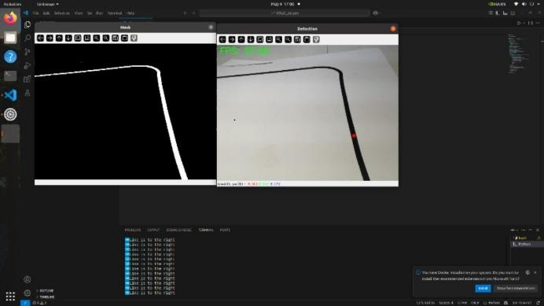
</p>

### Navigation

Given a start point `(x0, y0, z0)` and a target `(x1, y1, z1)`, the vehicle sets its depth and computes its heading. Pitch comes from:

```
pitch = arctan( (z1 - z0) / sqrt( (x1 - x0)² + (y1 - y0)² ) )
```

Visually detected fixed reference objects (buoys) are used to **periodically zero out accumulated IMU drift**.

### Attitude stabilisation

Waves knock the vehicle off attitude on all three axes. The BNO055 IMU measures the deviation in real time; the BNO086's built-in sensor-fusion algorithm produces clean **pitch, yaw and roll**. Angular errors are fed to a **PID controller** which computes the correction, and thruster power is adjusted accordingly. The PID gains are tuned for stability over long runs.

<p align="center">
  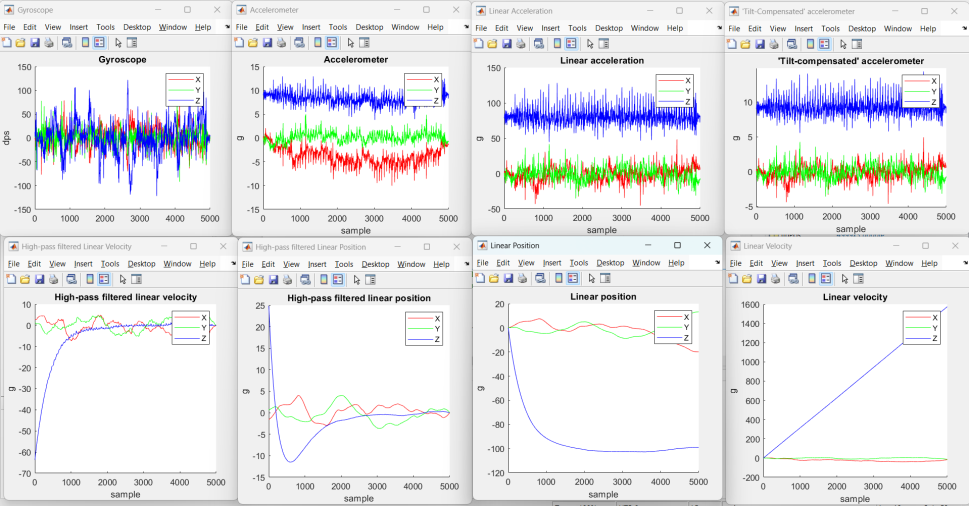
</p>

### Monocular distance estimation

For an object of known height, distance follows from the pinhole camera model:

```
D = H * F / P
```

where `H` is the real height of the object, `F` the focal length and `P` its height in pixels.

### Mission algorithms

**Atlantis** — set depth (z0 → z1) with the D300 depth sensor, compute heading with the navigation algorithm, and move using gyroscope, accelerometer and magnetometer data. If buoys are detected, the camera takes their image coordinates, the mean position is computed and the heading is updated toward it — which also corrects accumulated IMU error. With no buoy in view, the vehicle continues on IMU alone.

<p align="center">
  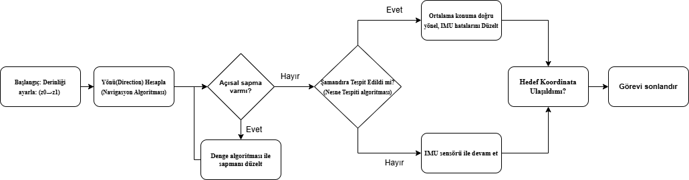
</p>

**Anomaly** — follow the underwater line with the camera while the balance algorithm keeps the vehicle level. Anomalies along the route are found by the object detector, recorded with OpenCV and analysed with YOLOv8l.

<p align="center">
  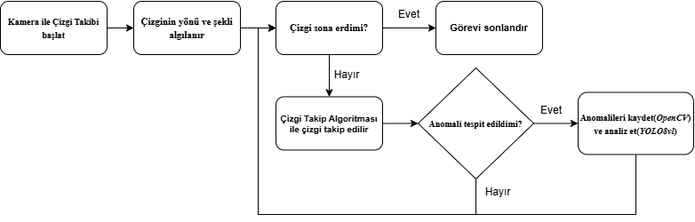
</p>

---

## Ground interfaces

**SSH over Ethernet** handles software updates and tests — code transfer and remote terminal access to the Jetson Orin NX.

**Wireless upload interface** — uploads code, views logs and checks battery status with no physical connection to the vehicle at all. Given that opening a sealed hull between runs is the single most annoying part of underwater robotics, this matters more than it sounds.

<p align="center">
  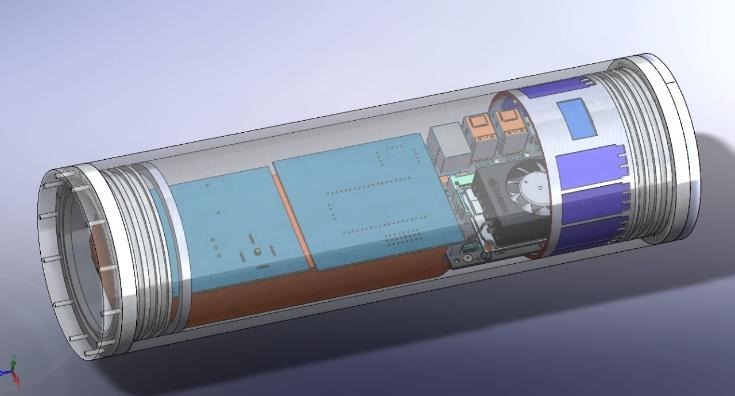
  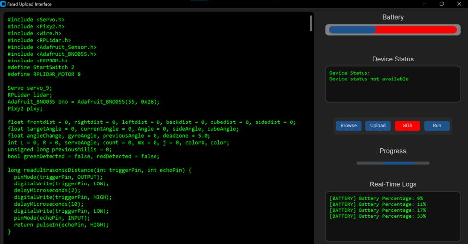
</p>

**Telemetry monitor** — collects live telemetry and sensor data from the flight controller and visualises it graphically and as text: acceleration, orientation, depth, battery and mission mode on one screen.

<p align="center">
  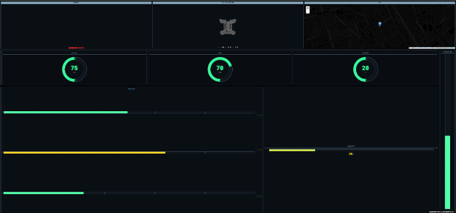
</p>

**On-board OLED** — battery level, mission mode (manual/autonomous) and link status, readable through the acrylic without opening anything.

---

## Safety

| Measure | Detail |
|---|---|
| **Magnetic kill switch** | A Hall-effect sensor on the pSub board cuts all power when a magnet is brought near the hull — no connector, no opening the vehicle |
| **Bluetooth power / mission control** | The ESP32-based uSub board pairs with an Android device, so power and mission start/stop are available wirelessly |
| **Blunted corners & shrouded motors** | Every corner is rounded and the body fully encloses the thrusters |
| **Overcurrent protection** | 10 A and 80 A relays cut power automatically on an abnormal current spike — including a swelling battery |

---

## Testing

| Test | Result |
|---|---|
| **Hull leak test** | Submerged at several water depths and held; no water ingress observed |
| **Magnetic switch** | Every trial cut and restored power correctly — safe shutdown and restart without external intervention |
| **YOLOv8l performance** | 20–25 FPS average in real field conditions; anomalies detected and classified successfully in real time |
| **Anomaly line-following** | Surface tests on a purpose-built course — the line was detected and followed successfully along the route |

---

## Lessons learned

Things that cost the team time, written down so they cost someone else less:

**Software**

- **MAVLink between the Jetson and the ESP32** refused to pass data at first — mismatched system and component IDs, plus serial conflicts. Once resolved, the link was stable.
- **YOLO was far too slow on the Jetson** running on CPU. Fixes: controlled CPU/GPU frequency overclocking, switching the model from FP32 to FP16, and enabling the CUDA cores.

**Mechanical & electronic**

- **Keep the distance between motor and body as short as possible.** A long motor arm takes serious damage in a collision. Solved by designing the body to enclose the motors closely and completely.
- **Print at 100 % infill.** Anything less slowly fills with water, and the vehicle loses its passive trim.
- **The A02YYUW "waterproof" ultrasonic sonar** does work underwater but does not send data back — hence the switch to the Ping sonar.

---

## Project management

### Timeline

<p align="center">
  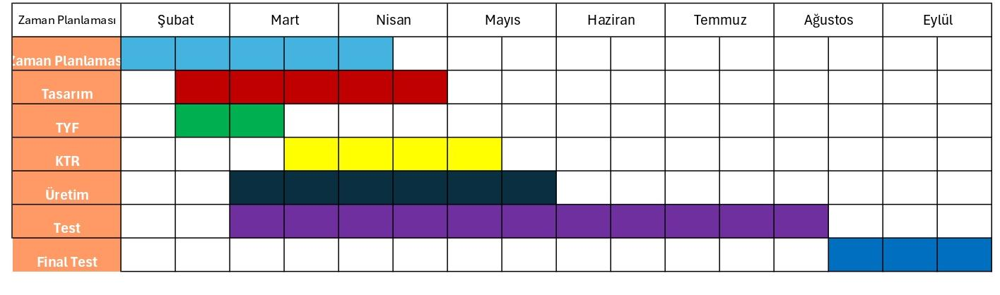
</p>

### Budget

| Item | Unit price (₺) | Qty | Total (₺) |
|---|---:|---:|---:|
| PLA filament | 683 | 6 | 4 058 |
| Logitech camera | 1 160 | 1 | 1 160 |
| IMU sensor | 1 355 | 1 | 1 355 |
| ESP32 | 116 | 1 | 116 |
| Voltage regulator | 116 | 2 | 332 |
| Power LED | 114 | 2 | 228 |
| Relay | 50 | 2 | 100 |
| Epoxy | 200 | 1 | 200 |
| Acrylic tube (1 m) | 2 600 | 1 | 2 600 |
| Flange machining | 2 500 | 2 | 5 000 |
| Ping sonar | 18 800 | 1 | 18 800 |
| **Total** | | | **33 951** |

Parts left over from TEKNOFEST 2024 and sponsor support kept the gap between the preliminary (₺17 910) and critical design (₺33 951) budgets as small as possible.

### Risk assessment

<p align="center">
  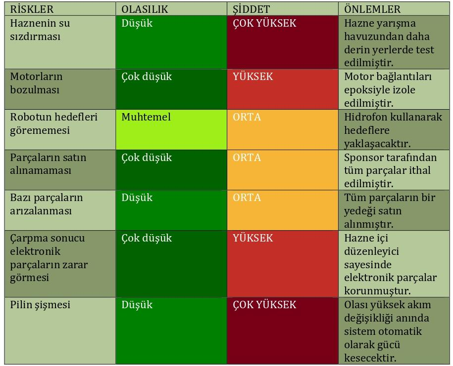
</p>

| Risk | Likelihood | Severity | Mitigation |
|---|---|---|---|
| Hull leak | Low | Very high | Tested deeper than the competition pool |
| Motor failure | Very low | High | Motor connections epoxy-insulated |
| Vehicle fails to see targets | Probable | Medium | Approach targets using the hydrophone |
| Parts not purchasable | Very low | Medium | All parts imported via sponsor |
| Component failure | Low | Medium | A spare bought for every part |
| Impact damage to electronics | Very low | High | Internal tray protects the electronics |
| Battery swelling | Low | Very high | Automatic power cut on abnormal current change |

---

## What is original here

**Software** — the object detector adds anything it recognises above 80 % confidence to its own dataset and retrains on it, improving without human intervention.

**Mechanical & electronic**

- A fully original, low-cost **waterproof 360° servo system** for the Ping sonar — cheaper and more capable than the alternatives.
- **Buoyancy pockets designed into the body** and filled with foam rather than bolt-on floats, so passive trim can be set precisely with the vehicle in the water.
- **uSub v1** flight controller and **pSub v1** power board, designed, prototyped and produced by the team.
- **Pressure hulls** — acrylic tube and aluminium flanges, machined locally, including all material processing.
- **Body** — designed entirely by the team and printed with filament from **Azfilament**, an Azerbaijani manufacturer.
- **Dataset** — shot with the team's own cameras and labelled by the team.

---

## Team

```
                        KAPTAN (Captain)
                               |
        ┌──────────────────────┼──────────────────────┐
   BAŞ MEKANİK           BAŞ ELEKTRONİK          BAŞ YAZILIMCI
  (Lead Mechanical)      (Lead Electronics)      (Lead Software)
        │                      │                       │
  Body design            System design            Stabilisation
  Pressure hulls         PCB design               Navigation
  General design         General design           Object detection
  & reporting            & reporting              Reporting
```

<p align="center">
  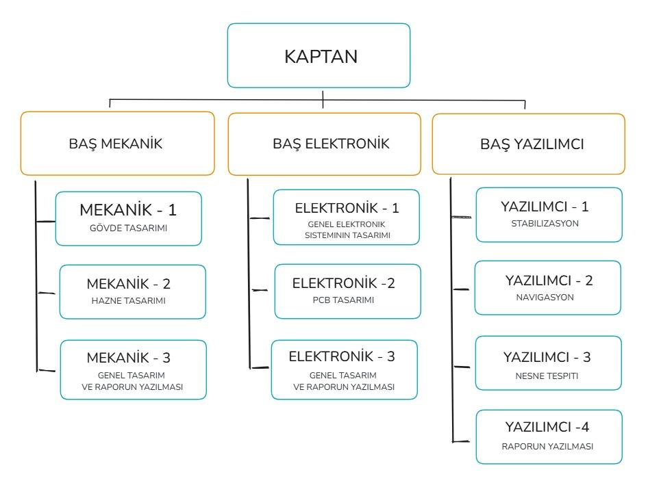
</p>

---

## Documentation

The full Critical Design Report (Kritik Tasarım Raporu, in Turkish) submitted to TEKNOFEST 2025:

📄 [`docs/FARAD_KTR_Report_2025.pdf`](docs/FARAD_KTR_Report_2025.pdf)

---

## References

- Molicel, *INR-18650-P26A Product Data Sheet*.
- Welch, G. & Bishop, G. (1995). *An Introduction to the Kalman Filter*. University of North Carolina at Chapel Hill.
- Deng, J., Xuan, X., Wang, W. et al. (2020). A review of research on object detection based on deep learning. *J. Phys.: Conf. Ser.* 1684:012028.
- Li, D. & Du, L. (2021). AUV trajectory tracking models and control strategies: A review. *Journal of Marine Science and Engineering*, 9(9), 1020.
- Gustafsson, J. & Mogensen, D. (2023). *Streamlining UAV Communication*.
- Espinosa, A.R., McIntosh, D. & Albu, A.B. (2023). An efficient approach for underwater image improvement: Deblurring, dehazing, and color correction. *IEEE/CVF WACV*, 206–215.
- Sharma, P., Kumar, A. & Kumar, N. (2022). Analysis of UART Communication Protocol. *ICECAA*, 323–328.
- Geng, Y. (2018). *Estimation of AUV position and attitude based on multi-sensor fusion*.
- Zhang, F. et al. (2024). Underwater object detection algorithm based on an improved YOLOv8. *Journal of Marine Science and Engineering*, 12(11), 1991.
- Vikash, R., KS, V.K. & AK, D.R. *Development of Ground Control Station for Low Level ROVs*.
- Muralikrishna, S. & Sathyamurthy, S. (2008). An overview of digital circuit design and PCB design guidelines — an EMC perspective. *IEEE EMI & Compatibility*, 567–573.
- Gibbons, A. (1985). *Algorithmic Graph Theory*. Cambridge University Press.
- Ojeda, L. & Borenstein, J. (2007). Non-GPS navigation with the personal dead-reckoning system. *Unmanned Systems Technology IX*, SPIE 6561, 110–120.
- Li, Y., Ang, K.H. & Chong, G.C. (2006). PID control system analysis and design. *IEEE Control Systems Magazine*, 26(1), 32–41.

---

<p align="center">
  <sub>Team FARAD · TEKNOFEST 2025 Unmanned Underwater Systems Competition · Advanced Category</sub>
</p>
